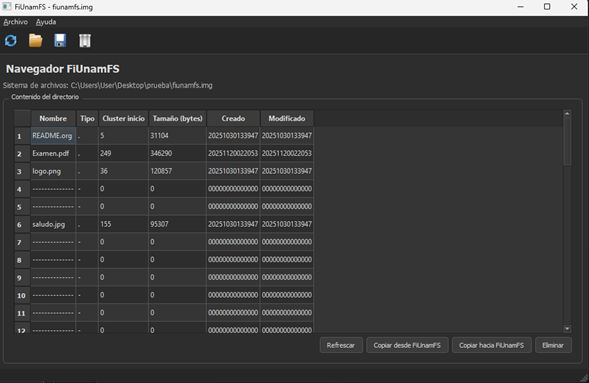
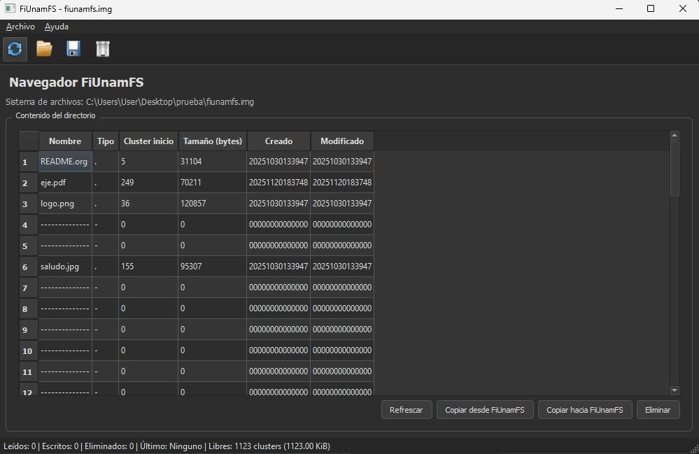
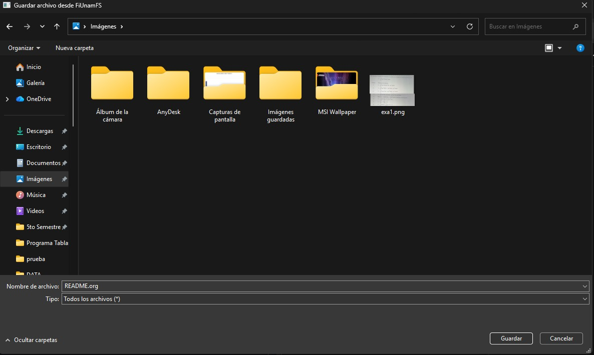
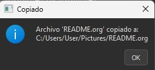
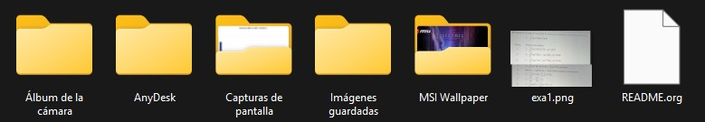

# 🗂️ FiUnamFS – Implementación Completa con GUI, CLI y Concurrencia
Sistema de Archivos para Sistemas Operativos • UNAM FI

---

## 📖 Descripción General

Este proyecto implementa una versión funcional del microsistema de archivos **FiUnamFS**, diseñado para ser almacenado dentro de una imagen binaria fija.  
El objetivo principal es simular el funcionamiento interno de un sistema de archivos real:

- Lectura del superbloque  
- Administración del directorio y sus entradas  
- Operaciones de archivos (copiar, crear, eliminar)  
- Manejo de clusters contiguos  
- Concurrencia con hilos  
- Interfaz gráfica moderna con PyQt5  
- Modo consola interactivo  

Este proyecto cumple los requisitos del Proyecto de Sistemas Operativos:

- Hilo monitor concurrente  
- Estadísticas en tiempo real  
- Operaciones seguras mediante exclusión mutua  
- Navegación completa del directorio  
- Soporte para GUI y CLI  

---

🏗️ Arquitectura del Proyecto \
├── 📄 constantes.py       # Valores fijos del sistema (tamaños, magic, version) \
├── 📄 entradas.py         # Clase DirEntry (estructura de cada entrada de directorio) \
├── 📄 estado.py           # EstadoFS: estadísticas compartidas  \
├── 📄 fiunamfs.py         # Implementación del sistema de archivos \
├── 📄 monitor.py          # Hilo daemon que imprime estadísticas \
├── 📄 sistema.py          # Aplicación en consola (CLI) \
└── 📄 gui_fiunamfs.py     # Interfaz gráfica en PyQt5 

---

# 🧬 Estructura Interna de FiUnamFS

FiUnamFS divide su imagen en **tres zonas principales**:

| Cluster | Descripción | 
|--------|--------|
| Cluster 0    | Superbloque    | 
| Cluster 1...N  | Directorio (entradas de 64 bytes)    | 
| Resto de la Imagen  | Zona de datos (clusters de archivos)   | 

---

## 📍 Formato del Superbloque

| Offset | Tamaño | Descripción |
|--------|--------|-------------|
| 0–7    | 8 B    | Magic `"FiUnamFS"` |
| 10–13  | 4 B    | Versión `"26-1"` |
| 20–36  | 16 B   | Etiqueta del volumen |
| 40–44  | 4 B    | Tamaño de cluster |
| 45–49  | 4 B    | Cantidad de clusters del directorio |
| 50–54  | 4 B    | Total de clusters |

---

## 📁 Formato de una Entrada de Directorio (64 bytes)
| Bytes  | Descripcion |
|--------|--------     |
| 0    | Tipo (ej. '.')    |
| 1–14  | Nombre (ASCII, 14 chars, padded)    |
| 16–19  | Cluster inicial (little endian)   |
| 20–23  | Tamaño del archivo    |
| 24–37  | Fecha creación (YYYYMMDDHHMMSS)    |
| 38–51 | Fecha modificación |
| 52–63 | Reservado |

Entradas libres se marcan como:
..............

---

# ⚙️ Funciones Principales Implementadas

### ✔ Lectura del directorio  
Interpreta todas las entradas de 64 bytes y las convierte en objetos **DirEntry**.

### ✔ Copiar archivo *desde* la imagen  
Extrae el archivo desde los clusters correspondientes y lo guarda localmente.

### ✔ Copiar archivo *hacia* la imagen  
- Busca entrada libre  
- Determina cuántos clusters requiere  
- Localiza un bloque **contiguo**  
- Lo escribe en la zona de datos  

### ✔ Eliminar archivo  
Marca la entrada como libre (relleno de puntos).

### ✔ Cálculo de espacio libre  
Estima clusters libres en la zona de datos y su equivalente en bytes.

### ✔ Concurrencia con hilos  
Se ejecuta un monitor que:

- Revisa operaciones realizadas  
- Muestra eventos recientes  
- Calcula el espacio libre  

### ✔ GUI completa  
Incluye:

- Tabla del directorio  
- Botones interactivos  
- Tema oscuro  
- Barra de estado con estadísticas  

---

# 🧵 Hilo Monitor – Concurrencia

El archivo `monitor.py` implementa un hilo daemon:

- Corre simultáneamente con cualquier modalidad (CLI o GUI)
- Cada 5 segundos:
  - bloquea el FS
  - consulta estadísticas
  - calcula espacio libre
  - imprime reporte en consola

### Ejemplo:
[MONITOR] Operaciones: leídos=2, escritos=1, eliminados=0 \
[MONITOR] Último evento: Copiado desde FS 'foto.jpg' \
[MONITOR] Clusters libres aprox.: 11 (693.00 KiB) 

---

# 🔧 Requisitos

### Python 3.x  
Recomendado: 3.8 o superior

### Dependencias
pip install PyQt5

---

# 🖥️ Ejecución en Modo Consola (CLI)
python sistema.py fiunamfs.img 
#### Menú:
1. Listar directorio
2. Copiar archivo desde FiUnamFS
3. Copiar archivo hacia FiUnamFS
4. Eliminar archivo
5. Salir

---

# 🖼️ Ejecución de la GUI
python gui_fiunamfs.py fiunamfs.img

Funciones soportadas:
- Copiar desde la imagen  
- Copiar hacia la imagen  
- Eliminar archivos  
- Refrescar directorio  
- Visualizar estadísticas del monitor  

### Ejemplo del sistema:

---

## 📂 Contenido del Disco FiUnamFS

El sistema de archivos `fiunamfs.img` viene preconfigurado con un conjunto mínimo de archivos iniciales.  
Al abrir la imagen en la GUI, aparecen las siguientes entradas:

### ✔ Archivos incluidos por defecto

| Nombre        | Tipo    | Descripción |
|---------------|---------|-------------|
| **README.org** | Archivo de texto | Documento base incluido en la imagen original del FS. Normalmente contiene notas o datos iniciales. |
| **logo.png**   | Imagen PNG | Archivo gráfico usado como prueba para validar lectura de archivos binarios. |
| **saludo.jpg** | Imagen JPG | Imagen adicional utilizada para verificar la correcta lectura y extracción de archivos dentro del sistema. |

Estos archivos sirven como contenido inicial para probar:

- la lectura correcta del directorio  
- el manejo de clusters contiguos  
- la extracción de archivos desde la imagen  
- la visualización correcta en la GUI  
- las operaciones básicas del sistema (copiar, eliminar, refrescar)

De esta forma, el usuario puede comenzar a utilizar FiUnamFS inmediatamente sin necesidad de cargar archivos externos.

---

# 📚 Descripción de Archivos

### **constantes.py**  
Define parámetros esenciales como:  
- tamaño del cluster  
- tamaño de entrada  
- magic string  
- versión  
- inicio del directorio  

### **entradas.py**  
Clase `DirEntry` que interpreta los 64 bytes de cada entrada.  
Incluye método `is_empty()`.

### **estado.py**  
Estructura `EstadoFS` para contadores de actividad:

- archivos leídos  
- archivos escritos  
- archivos eliminados  
- último evento  

### **fiunamfs.py**  
Núcleo del sistema:  

- Lectura del superbloque  
- Lectura del directorio  
- Copias hacia/desde imagen  
- Eliminación lógica  
- Búsqueda de clusters contiguos  
- Cálculo de espacio disponible  
- Protección con locks  

### **monitor.py**  
Hilo daemon que imprime:

- operaciones realizadas  
- último evento  
- espacio libre

### **sistema.py**  
Interfaz en consola para interactuar con FiUnamFS.

### **gui_fiunamfs.py**  
Interfaz gráfica moderna en PyQt5:

- tabla de directorio  
- botones  
- diálogos  
- tema oscuro  
- integración con el monitor  

---

# 🔬 Ejemplos de Uso

### 📤 Copiar archivo desde la imagen
Primero ejecutamos el programa para tener vista de la interfaz gráfica

Hacemos click en el botón "Copiar desde FiUnamFS"

Después nos abrirá un explorador de archivos para ir a la carpeta desea y poder guardar el archivo

Una vez dandole a "Guardar", la interfaz nos abrirá una box indicandonos la ruta donde se copio el archivo

Y solo nos queda comprabar que se haya copiado correctamente :) 

**NOTA: Esta ejecución esta probada para windows, por lo que el proceso puede variar dependiendo el sistema operativo"**
---

# 🛠️ Consideraciones Técnicas Importantes

- FiUnamFS requiere **clusters contiguos** para almacenar archivos.  
- Los nombres están limitados a **14 caracteres ASCII**.  
- Las entradas eliminadas dejan espacio reutilizable.  
- La GUI usa el *mismo* lock interno que la CLI.  
- El monitor nunca modifica la imagen.  

---

# 👨‍🏫 Criterios Evaluados

Este proyecto cubre:

- Lectura correcta del superbloque  
- Parsing del directorio  
- Copia desde/hacia la imagen  
- Eliminación de entradas  
- Concurrencia (con hilo monitor)  
- Comunicación segura entre hilos  
- GUI con PyQt5 completamente funcional  
- Alternativa CLI  
- Modularidad y documentación  

---

# 👥 Autores

**Jinenez Olivo Evelin** \
**Lara Hernández Emmanuel** \
**Alvarez Salgado Eduardo Antonio** \
Facultad de Ingeniería – UNAM  
Sistemas Operativos – Proyecto 2  

---
